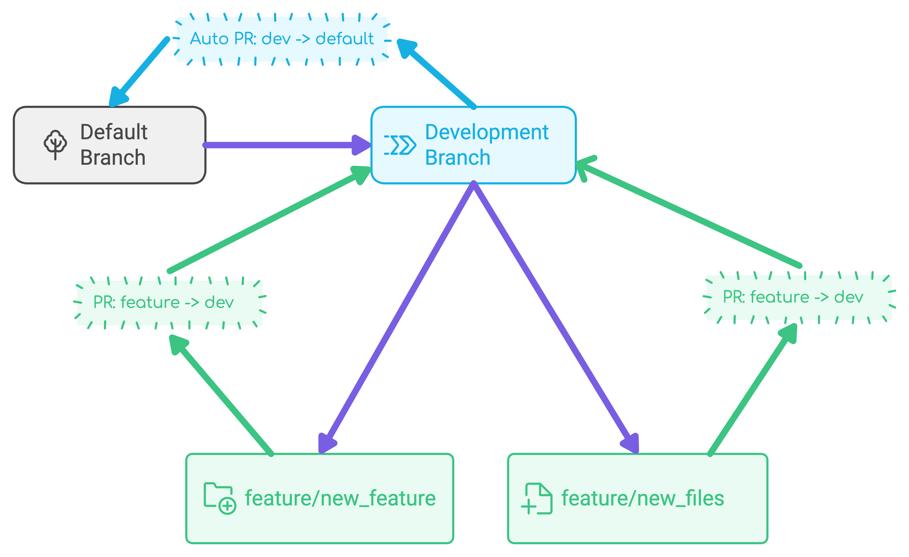

# Auto PR from Dev to Default Branch

## Description

This GitHub Action automatically creates or updates a Pull Request from a development branch to the default branch, generates descriptive PR content using OpenAI's API, and adds relevant reviewers.

## Features

- 🔄 Automatically creates or updates a PR from dev to the default branch
- 🤖 Generates PR descriptions using OpenAI API
- 👥 Automatically adds relevant reviewers
- 📅 Sets PR title with current date (e.g., "Release v2023.05.25")

## Inputs

| Name | Description | Required | Default |
|------|-------------|----------|---------|
| `openai_api_key` | OpenAI API Key | Yes | N/A |
| `openai_model` | OpenAI model to use for generating PR descriptions | No | 'gpt-4o-mini' |
| `github_token` | GitHub Personal Access Token with repo permissions | Yes | N/A |
| `dev_branch` | Name of the development branch | No | 'dev' |

## Outputs

| Name | Description |
|------|-------------|
| `pr_number` | The number of the pull request created or updated |

## Usage

To use this action in your workflow, add the following step:

```yaml
- name: Auto PR from Dev to Default
  uses: yuri-val/auto-pr-action@v1
  with:
    openai_api_key: ${{ secrets.OPENAI_API_KEY }}
    openai_model: gpt-4o  # Optional, defaults to 'gpt-4o-mini'
    github_token: ${{ secrets.GITHUB_TOKEN }}
    dev_branch: dev  # Optional, defaults to 'dev'
```

Make sure to set up the `OPENAI_API_KEY` secret in your repository settings.

### Example Workflow Using Your Custom Action

Create a workflow file in your repository (e.g., `.github/workflows/auto-pr.yml`):

```yml
name: Auto PR from dev to default

on:
  push:
    branches:
      - dev

jobs:
  auto-pr:
    runs-on: ubuntu-latest
    steps:
      - name: Run Auto PR Action
        uses: yuri-val/auto-pr-action@v1.0.0
        with:
          openai_api_key: ${{ secrets.OPENAI_API_KEY }}
          github_token: ${{ secrets.PAT_TOKEN }}
          dev_branch: 'dev'  # Optional, defaults to 'dev'

```

## How it works

1. Checks out the repository
2. Sets up Git configuration
3. Determines the default branch
4. Generates a diff between the dev and default branches
5. Uses OpenAI API to generate a descriptive PR content
6. Creates a new PR or updates an existing one
7. Adds relevant reviewers to the PR

## GitHub Workflow Description (Development Workflow)

### Branch Structure
1. Default Branch: `main` or `master`
2. Development Branch: `dev`
3. Feature Branches: Multiple branches like `feature/new_awesome_feature`, `feature/new_files`, etc.

### Workflow Steps



1. **Branch Creation:**
   - The `dev` branch is created from the default branch (`main` or `master`).
   - `dev` always contains all commits from the default branch.

2. **Feature Development:**
   - Multiple feature branches are created from `dev`.
   - Examples: `feature/new_awesome_feature`, `feature/new_files`, etc.
   - Developers work on these feature branches.

3. **Feature Integration:**
   - When a feature is complete, it is merged into the `dev` branch.

4. **Automated Pull Request Creation/Update:**
   - On every merge to `dev` (or any push to `dev`):
     - An automated process creates or updates a Pull Request from `dev` to the default branch (`main` or `master`).
     - The Pull Request description is automatically generated using OpenAI's API.
     - This ensures that the default branch is always aware of changes in `dev`.

5. **Continuous Integration:**
   - The `dev` branch continuously integrates new features.
   - The automated PR to the default branch is kept up-to-date with these changes.

6. **Review and Merge:**
   - The auto-generated PR can be reviewed and eventually merged into the default branch when ready.

This workflow allows for organized feature development, continuous integration into the `dev` branch, and an always up-to-date PR to the default branch with AI-generated descriptions for easy review and merging.

## License

[MIT License](LICENSE)

## Contributing

Contributions are welcome! Please feel free to submit a Pull Request.

This README.md provides an overview of your GitHub Action, including its features, inputs, outputs, and usage instructions. It also briefly explains how the action works and includes sections for licensing and contributions.

You may want to adjust the "Usage" section to reflect the correct GitHub username or organization where this action will be published. Also, if you haven't already, you might want to add a LICENSE file to your repository.

Feel free to modify this README to better fit your project's specific needs or to add any additional information you think would be helpful for users of your GitHub Action.
