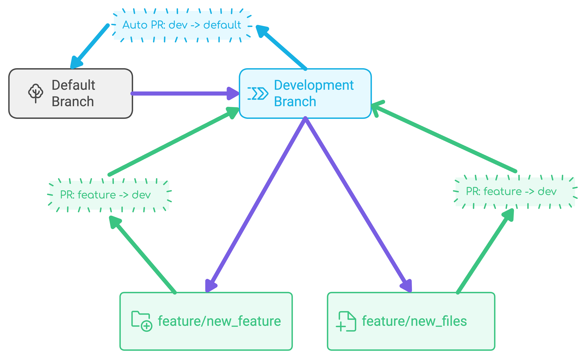

# Auto PR from Dev to Default Branch

## Description

This GitHub Action automatically creates or updates a Pull Request from a development branch to the default branch, generates descriptive PR content with OpenAI, Claude or OpenRouter, and adds relevant reviewers.

## Features

- 🔄 Automatically creates or updates a PR from dev to the default branch
- 🤖 Generates PR descriptions with OpenAI (default), Claude or OpenRouter — one script per provider in `providers/`
- 👥 Automatically adds relevant reviewers
- 📅 Sets PR title with current date (e.g., "Release v2023.05.25")

## Inputs

| Name | Description | Required | Default |
|------|-------------|----------|---------|
| `provider` | `openai`, `claude` or `open-router` (env `AI_PROVIDER`) | No | 'openai' |
| `model` | Model for the provider (env `AI_MODEL`) | No | openai: 'gpt-5.6-luna', claude: 'claude-haiku-5-5', open-router: 'deepseek/deepseek-v4.1-flash' |
| `openai_api_key` | OpenAI API key (env `OPENAI_API_KEY`) | For `openai` | N/A |
| `anthropic_api_key` | Anthropic API key (env `ANTHROPIC_API_KEY` / `CLAUDE_API_KEY`) | For `claude` | N/A |
| `anthropic_workspace_id` | Only for Anthropic keys not scoped to a workspace (env `ANTHROPIC_WORKSPACE_ID`) | No | N/A |
| `openrouter_api_key` | OpenRouter API key (env `OPENROUTER_API_KEY`) | For `open-router` | N/A |
| `openai_model` | Deprecated alias of `model` for `openai` | No | N/A |
| `github_token` | GitHub Personal Access Token with repo permissions | Yes | N/A |
| `dev_branch` | Name of the development branch | No | 'dev' |
| `max_diff_bytes` | Max size (bytes) of the diff payload sent to the model | No | '200000' |

## Outputs

| Name | Description |
|------|-------------|
| `pr_number` | The number of the pull request created or updated |

## Usage

To use this action in your workflow, add the following step:

```yaml
- name: Auto PR from Dev to Default
  uses: yuri-val/auto-pr-action@v1
  with:
    openai_api_key: ${{ secrets.OPENAI_API_KEY }}
    openai_model: gpt-5.6-terra  # Optional, defaults to 'gpt-5.6-luna'
    github_token: ${{ secrets.GITHUB_TOKEN }}
    dev_branch: dev  # Optional, defaults to 'dev'
```

Make sure to set up the secret for your provider (`OPENAI_API_KEY`, `ANTHROPIC_API_KEY` or `OPENROUTER_API_KEY`).

To use another provider, set it by input or once for the whole job by environment variable
(inputs win):

```yaml
    env:
      AI_PROVIDER: claude
      ANTHROPIC_API_KEY: ${{ secrets.ANTHROPIC_API_KEY }}
```

#### Which model writes best

Measured 2026-10-10 on three real PRs and one 5-commit release (all eight candidates followed
the output rules; times and costs are per description):

| Provider / model | Character | Avg time | Cost |
|---|---|---|---|
| openai / `gpt-6-luna` | shortest, accurate, fewest tokens | 3.5 s | $0.0007 |
| openai / `gpt-5.6-luna` | accurate, somewhat generic | 4.7 s | $0.0016 |
| claude / `claude-haiku-5-5` | most specific; the only model to catch every non-obvious change (e.g. a changed default with an upgrade note) | 4.7 s | $0.0014 |
| open-router / `deepseek/deepseek-v4.1-flash` | detailed and accurate | 4.4 s | $0.0028 |
| open-router / `z-ai/glm-5.3-flash` | detailed, occasional overstatement | 13.9 s | $0.0012 |
| open-router / `xiaomi/mimo-v2.6-flash` | detailed, slower | 15.8 s | $0.0011 |
| open-router / `google/gemini-3.8-flash` | concise, odd grouping, most expensive | 4.6 s | $0.0067 |
| open-router / `qwen/qwen3.8-flash` | long, very slow | 57.9 s | $0.0025 |

### Example Workflow Using Your Custom Action

Create a workflow file in your repository (e.g., `.github/workflows/auto-pr.yml`):

```yml
name: Auto PR from dev to default

on:
  push:
    branches:
      - dev

jobs:
  auto-pr:
    runs-on: ubuntu-latest
    # The PR is created with the PAT; the job token only needs to read the repo.
    permissions:
      contents: read
    steps:
      - name: Run Auto PR Action
        uses: yuri-val/auto-pr-action@v1
        with:
          openai_api_key: ${{ secrets.OPENAI_API_KEY }}
          github_token: ${{ secrets.PAT_TOKEN }}
          dev_branch: 'dev'  # Optional, defaults to 'dev'

```

## How it works

1. Checks out the repository
2. Sets up Git configuration
3. Determines the default branch
4. Generates a diff between the dev and default branches
5. Uses the chosen provider (OpenAI, Claude or OpenRouter) to generate a descriptive PR content
6. Creates a new PR or updates an existing one
7. Adds relevant reviewers to the PR — the commit authors (real users only; bots and the
   organisation account are skipped), plus the repository owner for personal repositories

### What is sent to the provider

The commit log, the per-file diffstat and the diff between the branches, capped at
`max_diff_bytes`. The contents of secret-bearing files — `.env*`, `*.pem`, `*.key`,
`*.p12`/`*.pfx`/`*.jks`, SSH keys, `.npmrc`/`.netrc`, `credentials.yml*`/`secrets.yml*` and
similar — are excluded from the diff; they appear in the diffstat by name only.

## GitHub Workflow Description (Development Workflow)

### Branch Structure
1. Default Branch: `main` or `master`
2. Development Branch: `dev`
3. Feature Branches: Multiple branches like `feature/new_awesome_feature`, `feature/new_files`, etc.

### Workflow Steps



1. **Branch Creation:**
   - The `dev` branch is created from the default branch (`main` or `master`).
   - `dev` always contains all commits from the default branch.

2. **Feature Development:**
   - Multiple feature branches are created from `dev`.
   - Examples: `feature/new_awesome_feature`, `feature/new_files`, etc.
   - Developers work on these feature branches.

3. **Feature Integration:**
   - When a feature is complete, it is merged into the `dev` branch.

4. **Automated Pull Request Creation/Update:**
   - On every merge to `dev` (or any push to `dev`):
     - An automated process creates or updates a Pull Request from `dev` to the default branch (`main` or `master`).
     - The Pull Request description is automatically generated by the configured provider (OpenAI by default).
     - This ensures that the default branch is always aware of changes in `dev`.

5. **Continuous Integration:**
   - The `dev` branch continuously integrates new features.
   - The automated PR to the default branch is kept up-to-date with these changes.

6. **Review and Merge:**
   - The auto-generated PR can be reviewed and eventually merged into the default branch when ready.

This workflow allows for organized feature development, continuous integration into the `dev` branch, and an always up-to-date PR to the default branch with AI-generated descriptions for easy review and merging.

## License

[MIT License](LICENSE)

## Contributing

Contributions are welcome! Please feel free to submit a Pull Request.

This README.md provides an overview of your GitHub Action, including its features, inputs, outputs, and usage instructions. It also briefly explains how the action works and includes sections for licensing and contributions.

You may want to adjust the "Usage" section to reflect the correct GitHub username or organization where this action will be published. Also, if you haven't already, you might want to add a LICENSE file to your repository.

Feel free to modify this README to better fit your project's specific needs or to add any additional information you think would be helpful for users of your GitHub Action.
